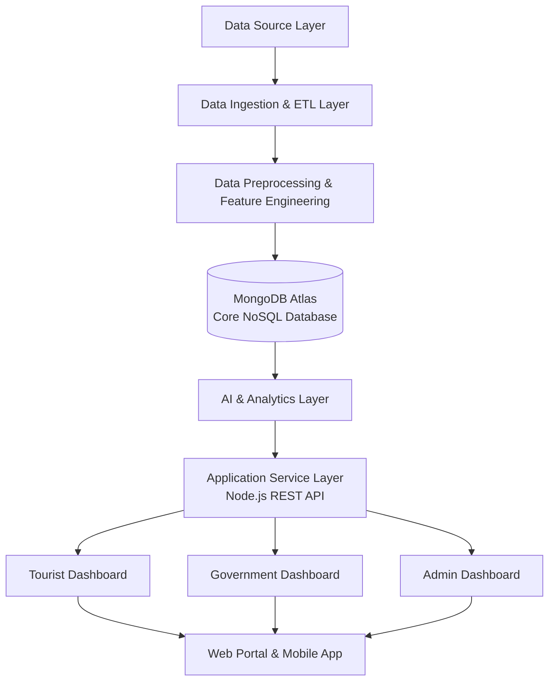
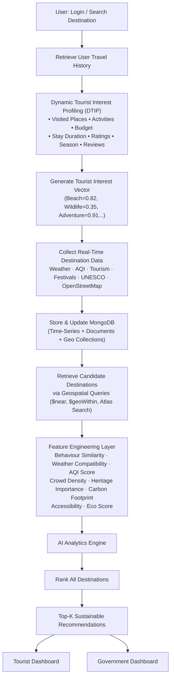

# EcoVoyage-AI-Intelligent-Sustainable-Tourism-Decision-Support-System

## 📌 Problem Statement

Tourism is one of the largest contributors to economic growth, but the rapid increase in tourist activities has led to several challenges such as overtourism, environmental degradation, traffic congestion, air pollution, damage to heritage sites, and inefficient resource management. Existing tourism platforms primarily recommend destinations based on popularity, ratings, or user-selected preferences through questionnaires. These systems often ignore real-time environmental conditions, sustainability factors, and the changing interests of users. Moreover, requiring users to complete preference surveys creates a poor user experience and often results in inaccurate recommendations.

Government tourism authorities also lack an integrated platform that combines real-time environmental data, historical tourism statistics, and tourist behavior to support data-driven policy decisions.

To address these limitations, this project proposes **EcoVoyage AI**, a NoSQL-based Sustainable Tourism Intelligence and Decision Support System that automatically learns tourist interests from historical travel behavior using **Dynamic Tourist Interest Profiling (DTIP)**, integrates real-time environmental and tourism data, computes an adaptive **Dynamic Tourism Sustainability Index (DTSI++)**, predicts crowd levels and carrying capacity, and recommends sustainable destinations while providing analytical dashboards for tourists and government authorities.

---

## 🎯 Objectives

### Primary Objective

To develop a NoSQL-based intelligent tourism recommendation and decision support system that provides personalized and sustainable travel recommendations by integrating historical tourist behavior with real-time environmental and tourism data.

### Specific Objectives

- Develop a **Dynamic Tourist Interest Profiling (DTIP)** model that infers user preferences from historical travel behavior instead of using questionnaires.
- Integrate real-time data from multiple sources, including weather, air quality, geospatial, tourism, and festival datasets.
- Design a flexible **MongoDB NoSQL database** using document collections, time-series collections, and geospatial indexing to efficiently manage heterogeneous tourism data.
- Develop an adaptive **Dynamic Tourism Sustainability Index (DTSI++)** to evaluate destination sustainability based on environmental and tourism factors.
- Predict tourist crowd density and destination carrying capacity using machine learning techniques.
- Develop a **hybrid recommendation engine** that combines user interests, sustainability scores, environmental conditions, and destination similarity to generate personalized recommendations.
- Provide interactive dashboards for tourists, government agencies, and administrators to support sustainable tourism planning and management.
- Evaluate the performance of the recommendation system using standard machine learning and recommendation metrics.

---

## 🌐 External APIs & Datasets

| **Data Source**                           | **Description**                                                                                                                               | **Purpose in Project**                                                                                                                                   |
| ----------------------------------------- | --------------------------------------------------------------------------------------------------------------------------------------------- | -------------------------------------------------------------------------------------------------------------------------------------------------------- |
| **OpenWeather API**                       | Provides real-time weather information such as temperature, humidity, rainfall, wind speed, and weather conditions.                           | Used to calculate the **Dynamic Tourism Sustainability Index (DTSI++)**, predict tourist crowds, and recommend destinations based on weather conditions. |
| **WAQI (World Air Quality Index) API**    | Provides real-time air quality measurements including AQI, PM2.5, PM10, CO, NO₂, and other pollutants.                                        | Used to evaluate environmental quality, compute sustainability scores, and recommend healthier destinations.                                             |
| **OpenStreetMap (OSM)**                   | Open-source geospatial dataset containing maps, tourist attractions, roads, transport networks, and nearby points of interest.                | Used for geospatial queries, nearby destination search, eco-route planning, and location-based recommendations using MongoDB's 2dsphere indexing.        |
| **India Open Government Tourism Dataset** | Historical tourism statistics including domestic and foreign tourist arrivals, visitor trends, and state-wise tourism data.                   | Used for crowd prediction, tourism trend analysis, government analytics, and training machine learning models.                                           |
| **UNESCO World Heritage Dataset**         | Contains information about UNESCO-recognized cultural and natural heritage sites, including location and category.                            | Used to enrich destination profiles and recommend heritage tourism destinations.                                                                         |
| **Festival Dataset**                      | Contains festival names, dates, locations, and expected tourist inflow during major events.                                                   | Used as an input feature for crowd prediction and estimating destination carrying capacity during festivals.                                             |
| **Tourist Behaviour Dataset (Custom)**    | Stores users' historical travel behavior, including visited destinations, activities, stay duration, budget, ratings, and travel preferences. | Used to build the **Dynamic Tourist Interest Profiling (DTIP)** model for personalized recommendations without requiring surveys.                        |

## OVERVIEW OF ARCHITECTURE 

1. **System Workflow** — overall data flow from user to dashboards
2. **AI Analytics Pipeline** — the detailed internal processing shown above

## 🏗️ System Workflow

---

### 1. Data Source Layer

| Source | Data Provided |
|---|---|
| 🌦 OpenWeather API | Real-time weather |
| 🌫 WAQI API | Air quality |
| 📍 OpenStreetMap | Geospatial data |
| 🏛 Government Tourism | Historical visitor data |
| 🏞 UNESCO | Heritage sites |
| 🎉 Festival Dataset | Events & holidays |
| 👤 Tourist Behaviour Dataset | Travel history, reviews, activities, budget, stay duration |

### 2. Data Ingestion & ETL Layer
- API Collectors
- Batch Import
- Scheduled Jobs
- Data Synchronization
- Validation

### 3. Data Preprocessing & Feature Engineering
- Missing value handling
- Duplicate removal
- Timestamp synchronization
- Coordinate standardization
- Feature extraction
- Tourist behaviour extraction
- Behaviour vector generation

### 4. MongoDB Atlas (Core NoSQL Database)

**Document Collections:** Users · Dynamic Tourist Profiles (DTIP) · Destinations · Reviews · Recommendations · Government Policies · Festival Events

**Time-Series Collections:** Weather Logs · AQI Logs · Tourist Statistics · Crowd History

**Geospatial Collections:** Tourist Attractions · Heritage Sites · Hotels · Protected Areas · Transport

**MongoDB Features Used:**
- ✅ Flexible Document Model
- ✅ Embedded Documents
- ✅ References
- ✅ Time-Series Collections
- ✅ 2dsphere Geospatial Index
- ✅ Aggregation Pipeline
- ✅ Atlas Search
- ✅ Change Streams
- ✅ TTL Index

### 5. AI & Analytics Layer

| # | Engine | Function |
|---|---|---|
| 1 | Dynamic Tourist Interest Profiling (DTIP) | Learns user preferences from historical travel behaviour |
| 2 | Dynamic Tourism Sustainability Index (DTSI++) | Calculates adaptive sustainability score |
| 3 | Crowd Prediction Engine | Predicts future tourist arrivals |
| 4 | Carrying Capacity Prediction | Estimates destination capacity dynamically |
| 5 | Hybrid Recommendation Engine | Combines behaviour + sustainability + weather + crowd |
| 6 | Destination Similarity Engine | Finds sustainable alternative destinations |
| 7 | EcoRoute Engine | Generates environmentally friendly travel routes |
| 8 | Government Policy Recommendation Engine | Suggests tourism management strategies |

### 6. Application Service Layer
**Node.js REST API** — Authentication · Recommendation Service · Notification Service · Report Generation

### 7. Dashboards

| Tourist Dashboard | Government Dashboard | Admin Dashboard |
|---|---|---|
| Personalized recommendations | Tourism heatmaps | User management |
| Weather & AQI | Crowd analytics | API monitoring |
| Eco routes | Sustainability KPI | Dataset updates |
| Similar places | Policy suggestions | Alerts |
| Carbon footprint | Capacity analysis | Review moderation |
| — | Government reports | System logs |

→ **Web Portal & Mobile App**

## 🔄 AI ANALYTICS PIPELINE / Internal System Processing Pipeline

This diagram shows what actually happens behind the scenes — from the moment the user opens the app to the moment a recommendation is shown.

---

### 🧠 AI Analytics Engine — Step by Step

| # | Module | Inputs | Output |
|---|---|---|---|
| ① | Interest Prediction | Behaviour Vector | User Preference Profile |
| ② | Crowd Prediction Model | Historical Visitors, Weather, Festivals, AQI | Predicted Tourist Count |
| ③ | Dynamic Carrying Capacity Prediction | Predicted Crowd, Weather, Water Availability, Protected Areas | Max Safe Visitors |
| ④ | Dynamic Sustainability Index (DTSI++) | AQI, Weather, Crowd, Carbon, Heritage, Water Stress | Sustainability Score (0–100) |
| ⑤ | Similarity Engine | Destination Features | Similar Destinations |
| ⑥ | Hybrid Recommendation Engine | All of the above | Final Ranked Recommendations |

## PROPOSED METHODOLOGY (IN DETAIL)

## 🧩 Proposed Methodology

The proposed methodology consists of eight sequential phases that collectively enable the development of a **NoSQL-based Sustainable Tourism Intelligence and Decision Support System**. The system integrates historical tourist behavior, real-time environmental data, and machine learning models to generate personalized and sustainable travel recommendations while supporting government decision-making.

---

### Phase 1: Data Acquisition

The first phase involves collecting data from multiple heterogeneous sources to build a comprehensive tourism database. The system integrates both **real-time** and **historical** datasets.

**Data Sources**

- **OpenWeather API** – Weather conditions (temperature, humidity, rainfall, wind speed)
- **WAQI API** – Air quality information (AQI, PM2.5, PM10)
- **OpenStreetMap** – Geospatial information (tourist attractions, routes, nearby locations)
- **Government Tourism Dataset** – Historical tourist arrivals and tourism statistics
- **UNESCO Heritage Dataset** – Heritage site information
- **Festival Dataset** – Festival dates and expected tourist inflow
- **Tourist Behaviour Dataset** – User travel history, activities, ratings, budget, travel duration

**Output:** Raw tourism, environmental, geospatial, and user behavior data.

---

### Phase 2: Data Preprocessing and Integration

The collected datasets undergo preprocessing to ensure consistency and quality before storage.

**Operations Performed**

- Remove duplicate records
- Handle missing values
- Standardize date and time formats
- Normalize numerical values
- Standardize geographical coordinates
- Merge datasets from different sources
- Encode categorical variables
- Validate data integrity

**Output:** Clean, standardized, and integrated datasets.

---

### Phase 3: MongoDB NoSQL Data Management

The processed data is stored in **MongoDB Atlas**, which serves as the central data repository. MongoDB is selected because of its flexibility in handling diverse and semi-structured tourism data.

**Collections**

- Users
- Dynamic Tourist Profiles
- Destinations
- Weather
- AQI
- Tourist Statistics
- Heritage Sites
- Festivals
- Recommendations
- Reviews
- Government Policies

**MongoDB Features Used**

- Document Collections
- Time-Series Collections
- Embedded Documents
- Geospatial (2dsphere) Indexes
- Aggregation Pipelines
- Atlas Search
- TTL Indexes

**Output:** Efficiently organized NoSQL database for real-time querying and analytics.

---

### Phase 4: Dynamic Tourist Interest Profiling (DTIP)

Unlike traditional tourism applications that rely on questionnaires, the proposed system automatically learns user preferences by analyzing historical travel behavior.

**Input Features**

- Previously visited destinations
- Preferred activities
- Budget
- Travel duration
- Ratings
- Travel season
- Transportation mode
- Reviews

**Process**

- Extract behavioral patterns
- Generate a user preference vector
- Continuously update the profile after every trip

**Output:** A **Dynamic Tourist Interest Profile (DTIP)** representing the user's travel interests without requiring manual surveys.

---

### Phase 5: Feature Engineering

Relevant features are extracted from multiple datasets to prepare inputs for machine learning models.

**Generated Features**

- Tourist Interest Score
- Weather Compatibility Score
- Air Quality Score
- Crowd Density Index
- Accessibility Score
- Heritage Importance Score
- Carbon Footprint Score
- Eco Score
- Destination Similarity Score

These features are combined into a unified feature vector for each destination.

---

### Phase 6: AI Analytics and Prediction

Machine learning techniques are employed to analyze tourism patterns and generate intelligent predictions.

#### Module 1: Crowd Prediction

Predicts future tourist arrivals based on historical trends and environmental conditions.

| | |
|---|---|
| **Inputs** | Historical visitors, Weather, Festivals, AQI, Season |
| **Algorithm** | Random Forest Regressor (or XGBoost) |
| **Output** | Predicted crowd density |

#### Module 2: Dynamic Tourism Sustainability Index (DTSI++)

Computes an adaptive sustainability score for each destination by combining environmental and tourism indicators.

**Factors:** Air Quality · Weather · Crowd Density · Carbon Footprint · Heritage Sensitivity · Accessibility · Water Availability

Unlike static scoring methods, the weight of each factor changes dynamically based on contextual conditions.

**Output:** Dynamic Sustainability Score (0–100).

#### Module 3: Destination Carrying Capacity Prediction

Estimates the maximum number of tourists a destination can sustainably accommodate under current conditions.

**Inputs:** Predicted crowd, Weather, Water availability, Infrastructure capacity, Protected area constraints

**Output:** Estimated carrying capacity.

#### Module 4: Hybrid Recommendation Engine

Generates personalized destination recommendations by combining multiple decision factors.

**Recommendation Factors**

- User Interest Profile (DTIP)
- Sustainability Score (DTSI++)
- Crowd Prediction
- Weather Compatibility
- Destination Similarity
- Distance
- Budget Compatibility

Destinations are ranked based on a composite recommendation score.

**Output:** Top-K sustainable destination recommendations.

---

### Phase 7: Dashboard Generation

The processed results are presented through dedicated dashboards.

**Tourist Dashboard**
- Personalized destination recommendations
- Sustainability score
- Crowd prediction
- Weather and AQI
- Eco-friendly route suggestions
- Similar destinations

**Government Dashboard**
- Tourism heatmaps
- Tourist density
- Destination carrying capacity
- Sustainability analytics
- Overtourism alerts
- Policy recommendations

**Admin Dashboard**
- User management
- Destination management
- Dataset updates
- API monitoring
- Review moderation
- System analytics

---

### Phase 8: Performance Evaluation

The proposed system is evaluated using both machine learning and recommendation system metrics.

**Prediction Metrics:** RMSE · MAE · R² Score

**Recommendation Metrics:** Precision@K · Recall@K · NDCG

**Database Performance:** MongoDB query execution time · Aggregation pipeline performance · Geospatial query latency · API response time

---

### ⭐ Novelty Highlight

The proposed methodology differs from existing tourism recommendation systems by:

- **Eliminating user questionnaires** through the **Dynamic Tourist Interest Profiling (DTIP)** module, which automatically learns preferences from travel history.
- **Introducing an adaptive Dynamic Tourism Sustainability Index (DTSI++)**, where factor weights change based on contextual conditions such as weather, festivals, or environmental risks.
- **Leveraging MongoDB's document, time-series, and geospatial capabilities** as the central platform for storing and processing heterogeneous tourism data.
- **Integrating multiple AI modules** (interest profiling, crowd prediction, carrying capacity estimation, and hybrid recommendation) into a unified **Decision Support System** that serves both tourists and government authorities.

This combination of behavioral personalization, sustainability analytics, and NoSQL-driven real-time processing distinguishes the proposed approach from conventional tourism recommendation platforms.

## 🖥️ Hardware Configuration

| Component | Specification |
|---|---|
| Processor | Intel Core i5 (10th Gen or above) / AMD Ryzen 5 or above |
| RAM | Minimum 8 GB (16 GB Recommended) |
| Storage | 256 GB SSD or higher |
| Graphics | Integrated Graphics (Dedicated GPU optional for faster ML training) |
| Internet | Stable broadband connection for accessing real-time APIs |
| Operating System | Windows 10/11, Ubuntu 22.04+, or macOS |

> **Minimum Requirement:** Intel i5 + 8 GB RAM + SSD

---

## 🛠️ Software Configuration

| Software | Purpose |
|---|---|
| Operating System | Windows 11 / Ubuntu / macOS |
| Python 3.11+ | Machine Learning & Backend Processing |
| MongoDB Atlas / MongoDB Community | NoSQL Database |
| MongoDB Compass | Database Management |
| Node.js | Backend API Development |
| Express.js | REST API Framework |
| React.js | Tourist, Government & Admin Dashboards |
| Visual Studio Code | Development Environment |
| Postman | API Testing |
| Git & GitHub | Version Control |
| Scikit-learn | Machine Learning Models |
| XGBoost | Crowd Prediction & Recommendation Models |
| Pandas | Data Preprocessing |
| NumPy | Numerical Computing |
| Matplotlib / Plotly | Data Visualization |
| Folium / Leaflet.js | Interactive Maps |
| JWT | Authentication & Authorization |

---

